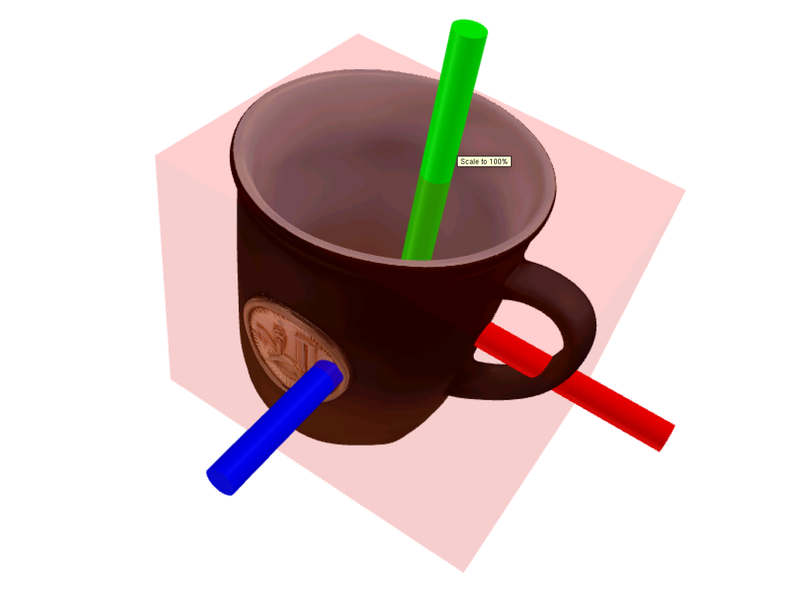
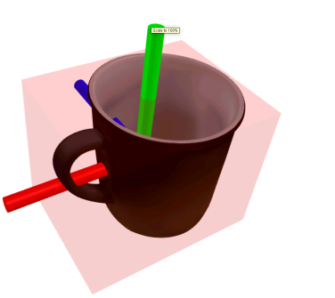

## Algorithm Overview


The principle can be summarized as "render and compare": render an image given the reference model and a pose hypothesis, then compare it with the observed image to derive pose corrections.
1. Pose hypothesis generation: Given an RGB-D image, detect the object using methods such as Mask R-CNN. Initialize translation with the median depth inside the 2D bounding box, and initialize rotation by uniformly sampling viewpoints on an icosphere centered at the object.
2. Pose refinement: Given the initial pose and the observation cropped according to that pose, compare the rendered result with the observation to output pose updates.
3. Pose selection: Use a hierarchical comparison network to score all pose hypotheses with global context, and choose the highest-scoring pose as the final estimate.


## How to Run
1. Environment setup: please refer to [FoundationPose](https://github.com/NVlabs/FoundationPose). Using Docker is recommended.
2. Data preparation:
   - Camera intrinsics
   - RGB-D video stream
   - First-frame object segmentation mask (can be generated by [Grounded-SAM](https://github.com/IDEA-Research/Grounded-Segment-Anything))
   - Reference object model (Mesh)

   Example directory layout:
   ```
   ├── cam_K.txt
   ├── rgb
   │   ├── 1581120424100262102.png
   │   ├── 1581120424148532296.png
   │   ├── 1581120424213125141.png
   │   ├── 1581120424269362478.png
   │   ├── ...
   ├── depth
   │   ├── 1581120424100262102.png
   │   ├── 1581120424148532296.png
   │   ├── 1581120424213125141.png
   │   ├── 1581120424269362478.png
   │   ├── ...
   ├── mask
   │   ├── 1581120424100262102.png
   ├── mesh
   │   ├── textured_simple.obj
   │   ├── textured_simple.obj.mtl
   │   └── texture_map.png
   ```
3. Run:
   ```bash
   python run_linemod.py --linemod_dir <data_dir> --use_reconstructed_mesh 0
   ```


## One Way to Obtain a Reference Model
Generate a CAD model using [Tencent Hunyuan Image-to-3D](https://3d.hunyuan.tencent.com/) (capture front/back/left/right views of the object, and keep the background visually rich):
<p align="center"><b>CAD models generated by Tencent Hunyuan Image-to-3D</b></p>
<p align="center">
  
  
  <!-- more images may exist in the original doc -->
  <!-- ... -->
  <!-- end of truncated content note -->
  
</p>

The CAD model generated by Image-to-3D is normalized in scale. For better results, resize it to the real-world size:
```bash
python mesh_utils.py -i input_mesh.obj -o output_mesh.obj --size <size along the smallest OBB extent(meters)>
```


## Effect of Reference Model Size

<div align="center">
  <figure style="display:inline-block;margin:0 8px;text-align:center;">
    <figcaption>Input: normalized reference mesh (no real-world scale)</figcaption>
    <video src="https://github.com/user-attachments/assets/afb7548f-dec5-42e0-ac96-f68508134305" width="60%" autoplay muted loop playsinline controls poster="images/posters/uniformed_size.jpg"></video>
    <br>
  </figure>

  <figure style="display:inline-block;margin:0 8px;text-align:center;">
    <figcaption>Input: reference mesh with real-world scale</figcaption>
    <video src="https://github.com/user-attachments/assets/828ab75d-b6e6-46b3-949a-f23a7986d6cf" width="60%" autoplay muted loop playsinline controls poster="images/posters/real_size.jpg"></video>
    <br>
  </figure>
  
</div>


**Conclusion**: The metric accuracy of the reference model's size has a significant impact on pose estimation performance and stability.


## Interference from Similar or Identical Objects

<div align="center">
  <figure style="display:inline-block;margin:0 8px;text-align:center;">
    <figcaption>Similar objects</figcaption>
    <video src="https://github.com/user-attachments/assets/a5930412-c449-43ce-951c-cbae3052ab23" width="60%" autoplay muted loop playsinline controls poster="images/posters/no_occlusion_similar.jpg"></video>
    <br>
  </figure>
  <figure style="display:inline-block;margin:0 8px;text-align:center;">
    <figcaption>Identical objects</figcaption>
    <video src="https://github.com/user-attachments/assets/676d984c-ed7f-447e-806f-2a0a21a2c393" width="60%" autoplay muted loop playsinline controls poster="images/posters/no_occlusion_same.jpg"></video>
    <br>
  </figure>
</div>

**Conclusion**: With no occlusion, similar/identical objects in the field of view have negligible impact on performance.

## Effect of Occlusion

<div align="center">
  <figure style="display:inline-block;margin:0 6px;text-align:center;">
    <figcaption>Occlusion by similar objects</figcaption>
    <video src="https://github.com/user-attachments/assets/69a8655a-5bf7-440d-adb4-0f1a9b8f7b06" width="60%" autoplay muted loop playsinline controls poster="images/posters/occlusion_similar.jpg"></video>
    <br>
  </figure>
  <figure style="display:inline-block;margin:0 6px;text-align:center;">
    <figcaption>Occlusion by identical objects (1)</figcaption>
    <video src="https://github.com/user-attachments/assets/336798cd-f437-4a66-bf24-8e6a297b47ed" width="60%" autoplay muted loop playsinline controls poster="images/posters/occlusion_same1.jpg"></video>
    <br>
  </figure>
  <figure style="display:inline-block;margin:0 6px;text-align:center;">
    <figcaption>Occlusion by identical objects (2)</figcaption>
    <video src="https://github.com/user-attachments/assets/cd4c5ac8-e83c-4c25-91c2-8b3fd2996747" width="60%" autoplay muted loop playsinline controls poster="images/posters/occlusion_same2.jpg"></video>
    <br>
  </figure>
</div>


**Conclusion**: For both similar and identical objects, short-term occlusions have comparable effects. FoundationPose shows certain robustness to short-term occlusions, but prolonged occlusions can lead to failure.


