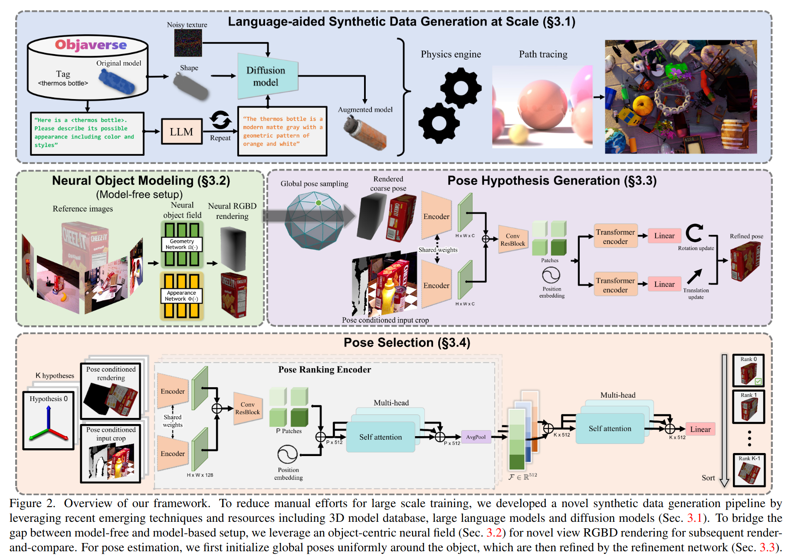
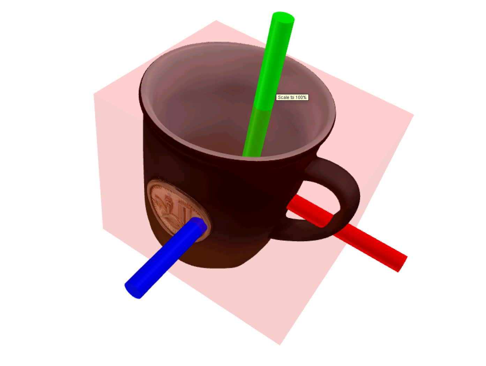
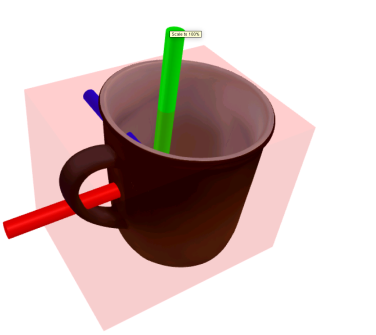

## 算法原理


原理可以概括为 render and compare，根据参考模型与位姿假设渲染图像并与观测图像进行对比得到位姿修正。
1.位姿假设生成​​：给定RGBD图像，使用Mask RCNN等方法检测物体，取2D边界框内的深度中位数来初始化平移，从以对象中心的icosphere上均匀采样视角来初始化旋转。
2. 位姿细化：输入为初始位姿和根据初始位姿裁剪后的观察图像，通过比较渲染结果与观察图像来输出位姿更新。
​​3.  位姿选择​​：使用分层比较网络利用所有位姿假设的全局上下文信息对姿态假设进行评分，选择得分最高的姿态作为最终估计。


## 操作步骤
1. 环境配置请参考[FoundationPose](https://github.com/NVlabs/FoundationPose)，推荐使用docker
2. 数据准备：
    - 相机内参
    - RGBD视频流
    - 首帧目标物体分割掩码，可以用[Grounded-SAM](https://github.com/IDEA-Research/Grounded-Segment-Anything)生成
    - 目标物体参考模型（Mesh）

    示例：
    ```
    ├── cam_K.txt
    ├── rgb
    │   ├── 1581120424100262102.png
    │   ├── 1581120424148532296.png
    │   ├── 1581120424213125141.png
    │   ├── 1581120424269362478.png
    │   ├── ...
    ├── depth
    │   ├── 1581120424100262102.png
    │   ├── 1581120424148532296.png
    │   ├── 1581120424213125141.png
    │   ├── 1581120424269362478.png
    │   ├── ...
    ├── mask
    │   ├── 1581120424100262102.png
    ├── mesh
    │   ├── textured_simple.obj
    │   ├── textured_simple.obj.mtl
    │   └── texture_map.png
    ```
3. 运行程序：
    ```bash
    python run_linemod.py --linemod_dir <data_dir> --use_reconstructed_mesh 0
    ```

## 一种参考模型获取方法
通过[腾讯混元图生3D](https://3d.hunyuan.tencent.com/)生成CAD模型（拍摄物体正/后/左/右视图，尽量保证背景色彩丰富）：
<p align="center"><b>使用腾讯混元图生3D生成的CAD模型</b></p>
<p align="center">
  
  
</p>

图生3D得到的CAD模型的尺寸是归一化的，要想获得较好的效果需要resize到真实尺寸
```bash
python mesh_utils.py -i input_mesh.obj -o output_mesh.obj --size <size along the smallest OBB extent(meters)>
```


## 参考模型尺寸影响

<div align="center">
  <figure style="display:inline-block;margin:0 8px;text-align:center;">
    <figcaption>输入归一化的参考 mesh 模型（无真实尺度）</figcaption>
    <video src="https://github.com/user-attachments/assets/afb7548f-dec5-42e0-ac96-f68508134305" width="60%" autoplay muted loop playsinline controls poster="images/posters/uniformed_size.jpg"></video>
    <br>
  </figure>
  <figure style="display:inline-block;margin:0 8px;text-align:center;">
    <figcaption>输入真实尺度的参考 mesh 模型</figcaption>
    <video src="https://github.com/user-attachments/assets/828ab75d-b6e6-46b3-949a-f23a7986d6cf" width="60%" autoplay muted loop playsinline controls poster="images/posters/real_size.jpg"></video>
    <br>
  </figure>
  
</div>

**结论**：参考模型的尺寸精度会显著影响位姿估计算法的性能与稳定性。


## 相似或相同物体干扰

<div align="center">
  <figure style="display:inline-block;margin:0 8px;text-align:center;">
    <figcaption>相似物体</figcaption>
    <video src="https://github.com/user-attachments/assets/a5930412-c449-43ce-951c-cbae3052ab23" width="60%" autoplay muted loop playsinline controls poster="images/posters/no_occlusion_similar.jpg"></video>
    <br>
  </figure>
  <figure style="display:inline-block;margin:0 8px;text-align:center;">
    <figcaption>相同物体</figcaption>
    <video src="https://github.com/user-attachments/assets/676d984c-ed7f-447e-806f-2a0a21a2c393" width="60%" autoplay muted loop playsinline controls poster="images/posters/no_occlusion_same.jpg"></video>
    <br>
  </figure>
  
</div>

**结论**：视野内的相似/相同物体在无遮挡情况下对性能影响可忽略。

## 遮挡的影响

<div align="center">
  <figure style="display:inline-block;margin:0 6px;text-align:center;">
    <figcaption>相似物体遮挡</figcaption>
    <video src="https://github.com/user-attachments/assets/69a8655a-5bf7-440d-adb4-0f1a9b8f7b06" width="60%" autoplay muted loop playsinline controls poster="images/posters/occlusion_similar.jpg"></video>
    <br>
  </figure>
  <figure style="display:inline-block;margin:0 6px;text-align:center;">
    <figcaption>相同物体遮挡1</figcaption>
    <video src="https://github.com/user-attachments/assets/336798cd-f437-4a66-bf24-8e6a297b47ed" width="60%" autoplay muted loop playsinline controls poster="images/posters/occlusion_same1.jpg"></video>
    <br>
  </figure>
  <figure style="display:inline-block;margin:0 6px;text-align:center;">
    <figcaption>相同物体遮挡2</figcaption>
    <video src="https://github.com/user-attachments/assets/cd4c5ac8-e83c-4c25-91c2-8b3fd2996747" width="60%" autoplay muted loop playsinline controls poster="images/posters/occlusion_same2.jpg"></video>
    <br>
  </figure>
</div>


**结论**：无论是相似物体还是相同物体，短时遮挡影响接近；FoundationPose 对短时遮挡具备一定鲁棒性，但长时间遮挡会导致失败。

